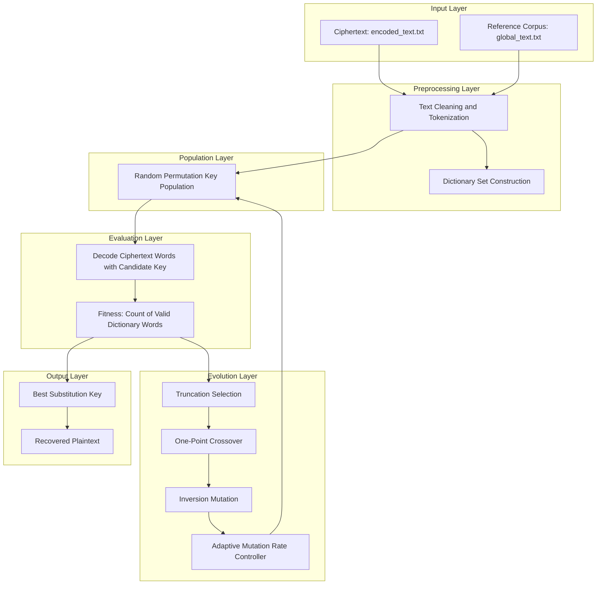
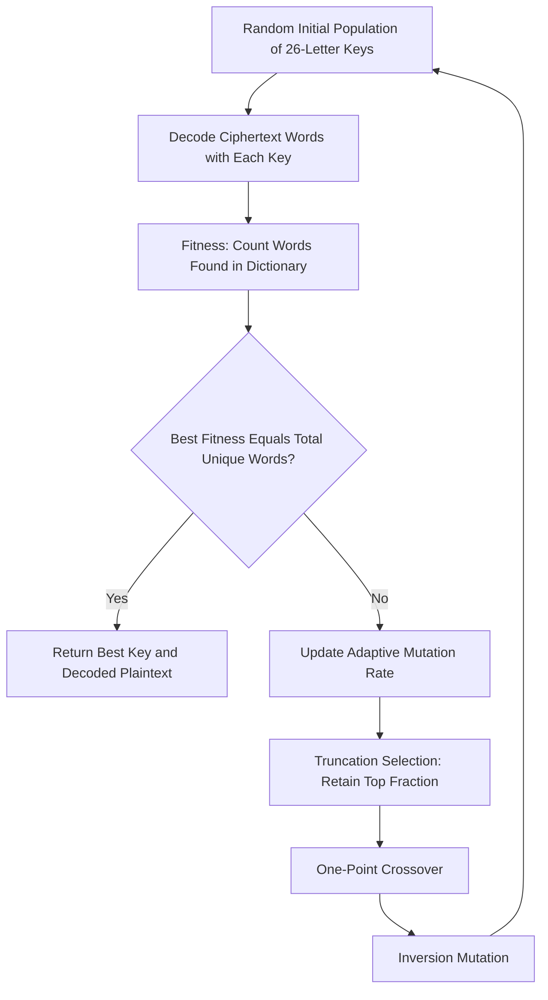

<div align="center">

</div>

---

# Substitution Cipher Cryptanalysis via Adaptive Genetic Algorithms

A from-scratch genetic algorithm that breaks classic monoalphabetic substitution ciphers by evolving candidate decryption keys against a dictionary-based fitness function, combining truncation selection, one-point crossover, inversion mutation, and an adaptive mutation-rate strategy.

<div align="left">

[](https://www.python.org/)
[](https://numpy.org/)
[](#)
[](#)
[](#)
[](#)
[](https://colab.research.google.com/)
[](https://opensource.org/licenses/MIT)

</div>

## Abstract

Monoalphabetic substitution ciphers replace each plaintext letter with a fixed corresponding letter, producing a search space of `26!` possible keys that is infeasible to brute-force. This project reframes key recovery as a combinatorial optimization problem and solves it with a genetic algorithm: candidate keys are represented as permutation chromosomes, fitness is measured by how many decoded words appear in a reference dictionary built from a large text corpus, and the population is evolved through truncation selection, one-point crossover, and inversion mutation. An adaptive mutation-rate mechanism is additionally introduced to escape stagnation when the search plateaus. Across population sizes of 50, 200, and 1000, and across the adaptive-mutation variant, the algorithm consistently converges to the exact correct key and fully recovers the original plaintext.

## Table of Contents

1. [Overview](#overview) — Problem Definition and Motivation
2. [System Architecture](#system-architecture) — Search and Evaluation Pipeline
3. [Genetic Algorithm Workflow](#genetic-algorithm-workflow) — From Random Keys to a Decoded Message
4. [Methodology](#methodology) — Encoding, Fitness, and Genetic Operators
   - 4.1 [Chromosome Representation and Dictionary-Based Fitness](#41-chromosome-representation-and-dictionary-based-fitness)
   - 4.2 [Selection, Crossover, and Mutation Operators](#42-selection-crossover-and-mutation-operators)
   - 4.3 [Adaptive Mutation Rate](#43-adaptive-mutation-rate)
5. [Experimental Setup](#experimental-setup) — Hyperparameters and Configurations
6. [Results and Analysis](#results-and-analysis) — Convergence Across Population Sizes
7. [Project Structure](#project-structure) — Repository Organization
8. [Usage and Installation](#usage-and-installation)
9. [License](#license)
10. [Author](#author)
11. [Support](#support)

# Overview

Recovering the key of a substitution cipher without a known-plaintext attack requires searching a permutation space of `26!` (≈ `4 × 10^26`) possible mappings. Instead of relying on classical frequency-analysis heuristics alone, this project treats the problem as a black-box optimization task and searches the permutation space with a genetic algorithm guided by a language-validity signal.

Core components include:

* Permutation-based chromosome encoding of 26-letter substitution keys
* Dictionary construction from a large reference text corpus
* Word-validity fitness scoring of decoded ciphertext
* Truncation selection, one-point crossover, and inversion mutation
* An adaptive mutation-rate controller that reacts to search stagnation
* Comparative experiments across multiple population sizes

---

# System Architecture

The system follows a search-and-evaluate architecture in which a population of candidate keys is repeatedly decoded, scored against a language model of valid words, and evolved toward higher fitness until the ciphertext is fully resolved.



### Architectural Components

| Layer | Responsibility |
|:---------|:---------------|
| Input Layer | Raw ciphertext and reference corpus used to build the dictionary |
| Preprocessing Layer | Text cleaning, tokenization, and dictionary-set construction |
| Population Layer | Random generation of permutation-based key chromosomes |
| Evaluation Layer | Decoding candidate keys and scoring them by dictionary word matches |
| Evolution Layer | Selection, crossover, mutation, and adaptive rate control |
| Output Layer | Best-performing key and the fully recovered plaintext |

This design keeps the search fully self-contained: no external language model is required, since the fitness signal is derived directly from vocabulary membership in the reference corpus.

# Genetic Algorithm Workflow



---

# Methodology

## 4.1 Chromosome Representation and Dictionary-Based Fitness

Each chromosome is a dictionary mapping each of the 26 lowercase letters to a unique substitute letter, effectively encoding a permutation of the alphabet:

```python
def generate_rand_chromosome(self):
    chromosomes = set(string.ascii_lowercase)
    new_chromosome = {}
    for c in string.ascii_lowercase:
        chromosome = random.choice(list(chromosomes))
        chromosomes.remove(chromosome)
        new_chromosome[c] = chromosome
    return new_chromosome
```

Fitness is computed by decoding every unique word of the ciphertext with a candidate key and counting how many of the decoded words exist in a dictionary built from a large reference text corpus:

```python
def fitness_calculator(self, population):
    scores = []
    for i in range(len(population)):
        chromosome = population[i]
        decoded_words = self.decode_with_key(chromosome, self.encoded_words)
        counter = sum(1 for word in decoded_words if word in self.dictionary)
        scores.append((counter, i))
    scores.sort(key=lambda score: score[0], reverse=True)
    return scores
```

The search terminates once the best chromosome's fitness equals the total number of unique ciphertext words, indicating a fully valid decoding.

## 4.2 Selection, Crossover, and Mutation Operators

**Truncation selection** retains only the top-performing fraction of the population as parents for the next generation. **One-point crossover** splits two parent permutations at a random point and repairs the offspring to preserve a valid bijective mapping:

```python
def crossover(self, parent1, parent2):
    parent1_list = list(parent1.values())
    parent2_list = list(parent2.values())
    point = random.randint(1, len(parent1_list) - 1)
    tmp = parent1_list[:point]
    parent2_list = [x for x in parent2_list if x not in tmp]
    new_chromosome_values = tmp + parent2_list
    return dict(zip(string.ascii_lowercase, new_chromosome_values))
```

**Inversion mutation** reverses a randomly chosen segment of the key's value sequence, introducing diversity while keeping the mapping a valid permutation.

## 4.3 Adaptive Mutation Rate

To prevent premature convergence, the mutation rate starts at `0.1` and doubles whenever the best fitness fails to improve for `10` consecutive generations, resetting the stagnation counter afterward:

```python
if best_score > previous_best_score:
    self.iter_without_improvement = 0
else:
    self.iter_without_improvement += 1
    if self.iter_without_improvement >= self.max_iter_without_improvement:
        self.mutation_rate *= 2
        self.iter_without_improvement = 0
```

This mechanism increases exploration precisely when the search stalls, without permanently sacrificing exploitation once progress resumes.

---

# Experimental Setup

| Parameter | Value |
|:---|:---|
| Population Sizes Tested | 50, 200, 1000 |
| Crossover Rate | 0.7 |
| Truncation Rate | 0.3 |
| Selection Strategy | Truncation (top 30%) |
| Crossover Operator | One-point, permutation-repairing |
| Mutation Operator | Inversion |
| Initial Mutation Rate (adaptive variant) | 0.1 |
| Stagnation Threshold | 10 generations without improvement |
| Mutation Rate Growth | ×2 upon stagnation |
| Termination Criterion | Best fitness equals total unique ciphertext words |
| Environment | Google Colab |

---

# Results and Analysis

| Configuration | Outcome |
|:---|:---|
| Population = 50 | Converged to the exact correct key; full plaintext recovered |
| Population = 200 | Converged to the exact correct key; full plaintext recovered |
| Population = 1000 | Converged to the exact correct key; full plaintext recovered |
| Population = 50 + Adaptive Mutation | Converged to the exact correct key; full plaintext recovered |

### Observations

- All four configurations independently converge to the **same 26-letter substitution key**, confirming that the dictionary-based fitness function provides a reliable and unambiguous search signal.
- Solution correctness is **independent of population size** in this setting, indicating that the combination of truncation selection and permutation-preserving crossover is already effective at maintaining useful genetic diversity even with a small population.
- The **adaptive mutation-rate strategy** provides a safeguard against premature convergence by injecting additional exploration whenever the search plateaus, without requiring the mutation rate to be manually tuned in advance.

---

# Project Structure

```
Substitution-Cipher-Cryptanalysis-via-Adaptive-Genetic-Algorithms
│
├── Substitution_Cipher_Cryptanalysis_via_Genetic_Algorithm.ipynb
│
├── Data/
│ ├── global_text.txt # Reference corpus used to build the dictionary
│ └── encoded_text.txt # Substitution-ciphered input text
│
├── requirements.txt
└── README.md
```


---

# Usage and Installation

## Clone Repository

```bash
git clone https://github.com/ParmidaGh/Substitution-Cipher-Cryptanalysis-via-Adaptive-Genetic-Algorithms.git
cd Substitution-Cipher-Cryptanalysis-via-Adaptive-Genetic-Algorithms
```

## Create Environment

```bash
conda create -n ga-cipher python=3.10
conda activate ga-cipher
```

## Install Dependencies

```bash
pip install -r requirements.txt
```

### Reproducibility

Update the file paths inside the notebook to point to the local `Data/` folder (the original notebook was developed on Google Colab and reads from `/content/drive/MyDrive/Data/`), then run the cells sequentially in `Substitution_Cipher_Cryptanalysis_via_Genetic_Algorithm.ipynb`.

---

# License

This project is licensed under the MIT License.

---

## Author

**Parmida Ghamari**
M.Sc. Student, University of Tehran
Research Assistant @ Social Networks Lab

**Research Interests:** Evolutionary Computation, Genetic and Metaheuristic Algorithms, Combinatorial Optimization, Cryptanalysis, Natural Language Processing (NLP), Soft Computing

📧 [Parmida.ghamari@gmail.com](mailto:Parmida.ghamari@gmail.com) | 💻 [github.com/ParmidaGh](https://github.com/ParmidaGh) | 💼 [www.linkedin.com/in/parmida-ghamari](https://www.linkedin.com/in/parmida-ghamari)

---

# Support

If you find this project useful, consider giving it a star ⭐

---

<p align="center">
Built using Python and NumPy
</p>
